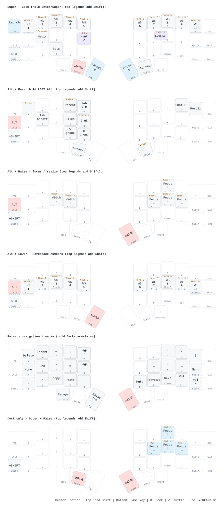
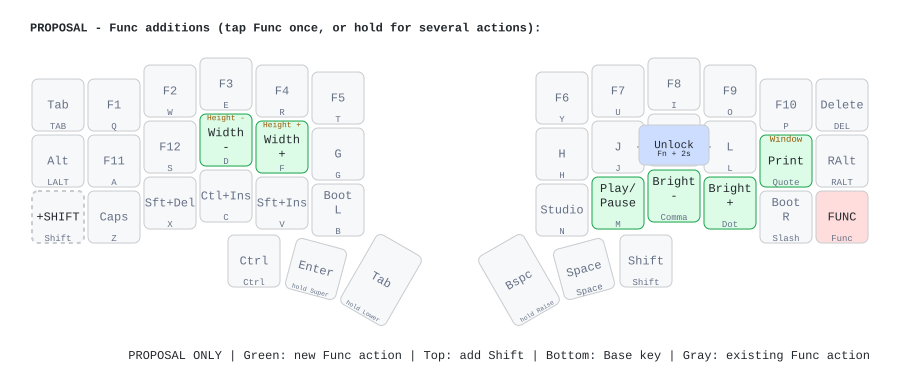

# Hyprland on Cosmos

Reference for the **current** Cosmos keymap and the bindings in `~/zuffie-nixos`.
The diagrams use the same 42-key Corne geometry as the main layout SVG. The
shortcut panels are visual overlays, not additional firmware layers.

## Recommendation

Your workspace shortcuts already fit Cosmos well: **hold Enter/Super and use
Q–P for workspaces 1–10; add Shift to move the window and follow it**. This avoids
holding Lower to reach the number keys.

Navigation uses **IJKL in an inverted T on Raise**: I is Up, J is Left, K is Down,
and L is Right. H is transparent and falls through to its Base letter. These
arrow keycodes also drive the existing Hyprland focus/move bindings.

Optional **Func utility additions**, described below, could simplify resizing and
supply missing Print Screen and media keys. Navigation stays on Raise: Func+I is
F8, so adding an IJKL focus cluster to Func would require relocating that key.

## Reading the current shortcut map

- **Center:** action with the modifiers/layer named in the panel heading.
- **Top, amber:** action when you also hold **Shift**.
- **Bottom:** the physical key's **Base-layer** label, even on Lower/Raise panels.
- **Pink:** keys to hold. The dashed left Shift is an optional extra modifier.
- **D / blue:** Steam Deck only. **Z / purple:** zuffie only.
- Empty centers mean no action is listed for that shortcut, not a disabled key.
- `WS` = workspace; `Magic` = the `special:magic` workspace; `Sets` = the
  `hypr-waytoggle` helper. It switches the configured workspace sets, wallpaper,
  and Waybar visibility; it is not the Deck's Wall display-mode toggle.



### Modifier and layer technique

| Needed input | Cosmos gesture |
|---|---|
| Super | Hold the **left middle thumb**, Enter/Super. |
| Alt | Use the **left outer home-row** Alt key. |
| Shift | Use the **left outer bottom-row** Shift key for a consistent position across layers. |
| Ctrl | Left outer thumb on Base; hold the Esc/Ctrl thumb if already on Raise. |
| Lower | Hold the **left inner thumb**, Tab/Lower. |
| Raise | Hold the **right inner thumb**, Backspace/Raise. |
| Func | Tap the bottom-right Func key for the next key, or hold it for several actions. |
| Escape | Press **J+K together on Base** (50 ms combo window), or hold Raise and tap the left outer thumb. |

Enter/Super, Tab/Lower, Backspace/Raise, and Raise's Esc/Ctrl are
**tap-preferred, 200 ms hold-taps**.
For reliable chords, let the hold resolve before pressing the action key. A fast
roll can produce Enter/Tab/Backspace instead. Backspace also has a 200 ms
quick-tap repeat window: after tapping it, pause before trying to hold it for Raise.

Alt, Shift, and Base Ctrl are sticky modifiers: a tap arms the next key for up to
1 second, and modifiers can be stacked. For repeated window operations, holding
them is simpler. **Physically hold Alt during mouse drags**: the independent
microswitches are not ordinary keymap keys that consume a sticky modifier.

Use **left Alt** in this guide. zuffie's `pl` layout uses right Alt as AltGr; the
Deck currently uses `us`. Also, the right outer thumb becomes **colon on Lower**,
so it is not a reliable place to start a Shift chord while Lower is active.

## Current actions, including the less obvious ones

`Super`, `Alt`, `Shift`, and `Raise` below mean the physical gestures above.

| Action | Existing Hyprland binding | Cosmos execution |
|---|---|---|
| Workspace 1–10 | Super+Q…P | Super + the corresponding top-row letter. |
| Move window to workspace and follow | Super+Shift+Q…P | Add outer Shift to the above. |
| Original numeric workspace shortcuts | Alt+[Shift]+1…0 | Alt + Lower + A S D F G H J K L Quote; add outer Shift to move. |
| Focus left/down/up/right | Alt+arrows | Alt + Raise + J/K/I/L. |
| Smart move left/down/up/right | Alt+Shift+arrows | Alt + Shift + Raise + J/K/I/L. The helper tries hy3 movement, then spills to an adjacent monitor at an edge. |
| Narrower/wider by 100 | Alt+minus/equal | Alt + Raise + **D/F**. |
| Shorter/taller by 100 | Alt+Shift+minus/equal | Alt + Shift + Raise + **D/F**. |
| Terminal | Alt+Enter | Hold Alt and **tap** Enter/Super. |
| Files | Alt+F | Alt+F on Base. |
| Perplexity / Grok / ChatGPT | Alt+P / G / O | Same letters on Base. |
| Launcher | Super+Space | Super + right middle thumb Space. |
| Toggle Waybar | Alt+Shift+Space | Alt + Shift + right middle thumb Space. |
| Close window | Alt+Shift+Q | Same chord on Base. |
| Reload Hyprland | Alt+Shift+R | Same chord on Base. |
| Vertical / horizontal / tabbed group | Alt+V / B / T | Same letters on Base. |
| Toggle tabbed group | Alt+S | Same chord on Base. |
| Select parent group | Alt+R | Same chord on Base; this is hy3 `changefocus raise`, not window z-order. |
| Change group orientation | Alt+Shift+G | Same chord on Base. |
| Toggle Magic / move window to Magic | Super+[Shift]+S | Same chords on Base. |
| Toggle configured workspace sets | Super+C | Same chord on Base; helper arguments are `-s 1,3 -t 4,6 -f DP-1`, so behavior depends on the connected monitors. |
| Previous/next workspace | Super+wheel up/down | Super + Raise + roll the trackball vertically. Raise converts motion into scroll. |
| Drag / resize window with trackball | Alt+left / right mouse drag | Hold left Alt and the corresponding **microswitch**, then roll the trackball; use pointer mode, with Raise released. |
| Speaker mute | XF86AudioMute | Raise+N. |
| Previous / next media item | XF86AudioPrev / Next | Raise+M / Comma. |
| Volume down / up | XF86AudioLowerVolume / RaiseVolume | Raise+Dot / Slash. |

For width resizing use **home-row D/F on Raise**, which emit unshifted minus/equal.
Raise's top-row E/R emit underscore/plus, including Shift, and therefore select
the **height** bindings instead when combined with Alt.

The focus/move/resize bindings are ordinary `bind`, not repeating `binde`:
tap the direction again for another operation. Volume and brightness use
`bindel`, so those commands repeat and are available on the lock screen.

### Host-specific and system shortcuts

| Binding | Status and Cosmos access |
|---|---|
| Super+Escape: lock | Configured on zuffie; **explicitly unbound on Deck** to keep R4+B unassigned. On zuffie: resolve Super, then J+K on Base. |
| Super+Shift+Escape: exit session | Configured on zuffie; **explicitly unbound on Deck** to avoid the controller logout chord. Add outer Shift to the preceding gesture. |
| Super+Ctrl+Escape: reboot | Still configured on both. On Base: hold Ctrl and Super, then J+K. |
| Super+Ctrl+Shift+Escape: power off | Still configured on both. Add outer Shift to the preceding gesture. |
| Super+arrows: focus | Deck addition. Super + Raise + J/K/I/L for left/down/up/right. |
| Super+Shift+arrows: move | Deck addition. Add Shift; calls **hy3 directly**, unlike the Alt+Shift smart-move helper. |
| Super+Backspace: close | Deck addition. Resolve Super, then tap Backspace/Raise. |
| Super+Tab: launcher | Deck addition. Hold Super and use the top-left Tab; Super+Space also works. |
| Super+Enter: terminal | Deck addition, but **not directly producible** by the current Cosmos layout: Enter and the only Super are the same hold-tap key. Use the shared Alt+Enter instead. |
| XF86PowerOff: suspend | Deck power-button binding; no corresponding Cosmos key. This is separate from the reboot/power-off Escape chords. |
| Super+G / Super+Shift+G | zuffie-only `stochos --hint` / `stochos`, triggered on **key release**. Hold Super, tap/release G; add Shift for the second form. |

The nixmac host also adds Alt+C/V for copy/paste. Its Alt+V overlaps the shared
vertical-group binding; that is a separate host-specific conflict, not part of
the Deck/zuffie shortcut map above.

### Keys the current Cosmos layout cannot emit

- **Print Screen:** all four existing Print shortcuts are inaccessible directly:
  region capture, Shift+Print window capture, Ctrl+Print output capture, and
  Alt+Print color picker.
- **Play/pause**, **brightness up/down**, and **microphone mute** are bound in
  Hyprland but have no key in the current Cosmos map.
- The Deck's keyboard lock shortcut is unbound at the host level; adding an
  Escape key or another way to send Super+Escape would not restore it.

There is also an independent screenshot command issue: the current bindings use
`hyprshot --clipboard-only && satty --filename -`. This puts the image in the
clipboard but supplies **no image stream to Satty's stdin**. Adding a Print key
will make the binding reachable, but the editor hand-off still needs attention.
A working image-stream form uses `hyprshot -m region --raw | satty --filename - ...`.
If preserving the existing Print bindings exactly is important, a new shortcut
can use that pipeline instead.

## Suggested Func additions — proposal, not installed

Physical Func+J+K+L is reserved for the [private USB unlock chord](UNLOCK.md). It
requires a two-second physical hold and personalized firmware; one-shot Func
does not activate it.

These positions are all currently **transparent on Func**. Adding actions there
preserves Base typing, the defined F1–F12/editing/bootloader/Studio actions, and
the Hyprland chords used on the Keychron. The affected letters would, of course,
gain these meanings while Func is active rather than falling through to Base.



| Func + physical key | Proposed ZMK binding | Result |
|---|---|---|
| D / F | `&kp LA(MINUS)` / `&kp LA(EQUAL)` | Width resize; add Shift for height. |
| Quote | `&kp PRINTSCREEN` | Print; add Shift/Ctrl/Alt for the existing variants. |
| M | `&kp C_PLAY_PAUSE` | Play/pause. |
| Comma / Dot | `&kp C_BRI_DN` / `&kp C_BRI_UP` | Brightness. |

The diagram shows the **six proposed additions** in green; gray keys retain their
current Func behavior. Tap Func then an action for one-shot use; hold Func while
tapping several actions. This also avoids holding Raise, so moving the trackball
continues to point rather than scroll while using the proposed resize shortcuts.

For a one-shot **Shift+Func** action, press/hold Shift **before** tapping Func,
then press the action key. Alternatively, keep Func physically held while adding
modifiers. The current sticky-layer behavior does not ignore modifier presses:
tapping Func and then pressing Shift would consume the one-shot layer too early.
The same ordering applies to Ctrl/Alt variants of the proposed Print key.

Two optional **additive host bindings** could fill the remaining gaps:

- **Super+Ctrl+M** for `wpctl set-mute @DEFAULT_AUDIO_SOURCE@ toggle`; optionally
  emit it from Func+G with `&kp LG(LC(M))`. The pinned ZMK key header does not
  define a ready-made `C_MIC_MUTE` alias, so do not assume one will build.
- **Super+Ctrl+L** for keyboard lock, using `steam-deck-hyprlock` on the Deck to
  retain its on-screen keyboard support and `hyprlock` on zuffie. This avoids
  restoring the controller-associated Super+Escape binding.

Neither chord is currently claimed by the inspected Hyprland configuration.
These are suggestions, not active bindings or part of the green proposal diagram.

### If a dedicated Hyprland layer is preferable

A separate Cosmos layer could put workspace chords on Q–P, focus chords in an
IJKL inverted T, resize on D/F, and app/group actions on their familiar letters.
Shift could select
the existing move variants. It can emit the **existing** host shortcuts, so it
does not require replacing Keychron bindings or adding global Alt+I/J/K/L aliases
that would consume those combinations in applications.

Workspace 8 and Up would compete for I on such a layer, so its workspace keys
would need a different placement or modifier. This is another reason to try the
existing Super+Q–P workspace shortcuts and Raise navigation first.

The extra decision is how to enter it: all six thumb positions and the Func key
already have functions. A new combo is possible; changing Func into a tap/hold
layer selector would alter its existing hold behavior.

## Sources and regeneration

Hyprland was reviewed on 2026-09-28 against zuffie-nixos `abe4cd8` and the running
Deck's `hyprctl -j binds` and keyboard layout. These diagrams follow the current
Cosmos repository keymap, including IJKL navigation on Raise; separate ZMK Studio
remaps need to be accounted for if in use.

- `boards/shields/cosmos/cosmos.keymap` and `cosmos_right.overlay`
- `~/zuffie-nixos/home/hyprland/hyprland.conf`
- `~/zuffie-nixos/home/hyprland.nix` (smart-move, workspace sets, Deck power button)
- `~/zuffie-nixos/home/hyprland/{steam-deck,zuffie,nixmac}.conf`
- `~/zuffie-nixos/hosts/steam-deck/desktop.nix` (final logout unbind)
- `~/zuffie-nixos/home/hyprland/{hypr-smart-move,hypr-waytoggle}.go`

The action labels in `assets/cosmos_hyprland.yaml` and
`assets/cosmos_hyprland_proposal.yaml` are hand-maintained reference/proposal data.
They are not compiled into firmware. Regenerate all diagrams with:

```bash
nix run .#update-assets
```
