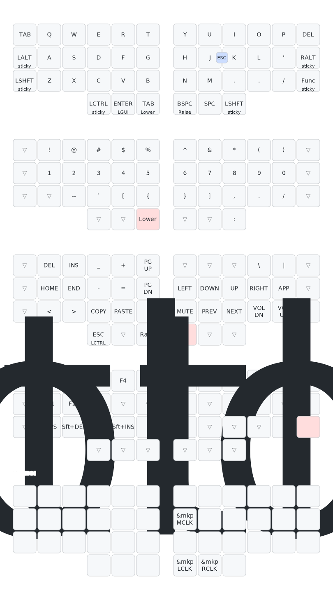

# Mark Stosberg Layout for Cosmos Keyboard

This is an adaptation of [Mark Stosberg's Corne layout](https://github.com/markstos/qmk_userspace/blob/main/keyboards/crkbd/keymaps/markstos/keymap.c) for the Cosmos split keyboard running ZMK firmware.

## Layout Overview

Via https://github.com/caksoylar/keymap-drawer/ 


### Base Layer (QWERTY)

```
┌─────┬─────┬─────┬─────┬─────┬─────┐   ┌─────┬─────┬─────┬─────┬─────┬─────┐
│ TAB │  Q  │  W  │  E  │  R  │  T  │   │  Y  │  U  │  I  │  O  │  P  │ DEL │
├─────┼─────┼─────┼─────┼─────┼─────┤   ├─────┼─────┼─────┼─────┼─────┼─────┤
│LALT │  A  │  S  │  D  │  F  │  G  │   │  H  │  J  │  K  │  L  │  ;  │RALT │
├─────┼─────┼─────┼─────┼─────┼─────┤   ├─────┼─────┼─────┼─────┼─────┼─────┤
│LSHFT│  Z  │  X  │  C  │  V  │  B  │   │  N  │  M  │  ,  │  .  │  /  │ FUN │
└─────┴─────┴─────┼─────┼─────┼─────┤   ├─────┼─────┼─────┼─────┴─────┴─────┘
                  │LCTL │GUI/ │LOW/ │   │RSE/ │ SPC │LSHFT│
                  │     │ ENT │ TAB │   │ BSP │     │     │
                  └─────┴─────┴─────┘   └─────┴─────┴─────┘
```

**Features:**
- **Outer Columns**: TAB (left), DEL (right), with sticky modifiers on rows 1-2
- **Thumb Cluster**:
   - Left: LCTRL (sticky) | GUI/Enter (mod-tap) | Lower/Tab (layer)
   - Right: Raise/Backspace (layer) | Space | LSHIFT (sticky)

### Lower Layer

```
┌─────┬─────┬─────┬─────┬─────┬─────┐   ┌─────┬─────┬─────┬─────┬─────┬─────┐
│     │  !  │  @  │  #  │  $  │  %  │   │  ^  │  &  │  *  │  (  │  )  │     │
├─────┼─────┼─────┼─────┼─────┼─────┤   ├─────┼─────┼─────┼─────┼─────┼─────┤
│     │  1  │  2  │  3  │  4  │  5  │   │  6  │  7  │  8  │  9  │  0  │     │
├─────┼─────┼─────┼─────┼─────┼─────┤   ├─────┼─────┼─────┼─────┼─────┼─────┤
│     │  ~  │  `  │  [  │  {  │  ]  │   │  }  │  <  │  >  │  /  │     │     │
└─────┴─────┴─────┼─────┼─────┼─────┤   ├─────┼─────┼─────┼─────┴─────┴─────┘
                  │     │     │ FUNC│   │     │  :  │  ;  │                  
                  └─────┴─────┴─────┘   └─────┴─────┴─────┘                  
```

### Raise Layer

```
┌─────┬─────┬─────┬─────┬─────┬─────┐   ┌─────┬─────┬─────┬─────┬─────┬─────┐
│     │ DEL │ INS │  _  │  +  │PGUP │   │     │     │     │  \  │  |  │     │
├─────┼─────┼─────┼─────┼─────┼─────┤   ├─────┼─────┼─────┼─────┼─────┼─────┤
│     │HOME │END  │  -  │  =  │PGDN │   │LEFT │DOWN │ UP  │RIGHT│MENU │     │
├─────┼─────┼─────┼─────┼─────┼─────┤   ├─────┼─────┼─────┼─────┼─────┼─────┤
│     │  <  │  >  │ CPY │ PST │  ;  │   │MUTE │PREV │NEXT │VOLD │VOLU │     │
└─────┴─────┴─────┼─────┼─────┼─────┤   ├─────┼─────┼─────┼─────┴─────┴─────┘
                  │CTL/E│     │ FUNC│   │     │     │     │                  
                  └─────┴─────┴─────┘   └─────┴─────┴─────┘                  
```

### Mouse Layer (activated upon moving the trackball)

```
┌─────┬─────┬─────┬─────┬─────┬─────┐   ┌─────┬─────┬─────┬─────┬─────┬─────┐
│     │     │     │     │     │     │   │     │     │     │     │     │     │
├─────┼─────┼─────┼─────┼─────┼─────┤   ├─────┼─────┼─────┼─────┼─────┼─────┤
│     │     │     │     │     │     │   │MCLK │     │     │     │     │     │
├─────┼─────┼─────┼─────┼─────┼─────┤   ├─────┼─────┼─────┼─────┼─────┼─────┤
│     │     │     │     │     │     │   │     │     │     │     │     │     │
└─────┴─────┴─────┼─────┼─────┼─────┤   ├─────┼─────┼─────┼─────┴─────┴─────┘ 
                  │     │     │     │   │LCLK │RCLK │     │                  
                  └─────┴─────┴─────┘   └─────┴─────┴─────┘                  
```

**Mouse Buttons:**
- **LCLK**: Left mouse click (press and hold for drag operations)
- **RCLK**: Right mouse click
- **MCLK**: Middle mouse click

## Combos

Combos work on the base layer with 50ms timeout:

| Combo | Keys | Output |
|-------|------|--------|
| esc | J+K | ESC |

## Behaviors

### Thumb Keys
- **gui_ent**: GUI/Enter mod-tap
- **low_tab**: Lower layer/Tab mod-tap
- **rse_bsp**: Raise layer/Backspace mod-tap

### Sticky Keys
- LALT, RALT, LSHFT, LCTRL on outer columns

## Important Notes

1. **Split Keyboard**: Right half is central, left is peripheral
2. **Bootloader**: Fn-B for left half, Fn-? for right half
3. **Key Matrix**: 4 rows × 12 columns (6 per half)

## Trackball Support (Right Half)

This firmware includes support for a PMW3360/PMW3389 optical trackball sensor on the right half.

### Flashing

1. `git push`
2. gh run download
3. Left half flash: Fn-B, USB device appears, copy corresponding .uf2
3. Right half flash: Fn-?, USB device appears, copy corresponding .uf2

### Hardware Pinout

| Signal | Pin | Description |
|--------|-----|-------------|
| VIN | 3.3V | Power supply (DO NOT use 5V!) |
| GND | GND | Ground |
| SCK | P0.08 | SPI Clock |
| MOSI | P0.20 | SPI Data Out |
| MISO | P0.17 | SPI Data In |
| CS | P0.06 | SPI Chip Select |
| MT | P0.02 | Motion interrupt (optional but recommended) |
| RST | P1.15 | Reset (optional) |

### Configuration

- **Driver**: george-norton/zmk-driver-pmw3360
- **CPI**: 50 (minimum for precision, configurable 50-16000)
- **Mode**: Interrupt-based (uses MT pin for better responsiveness)
- **IRQ GPIO**: P0.02 with `GPIO_ACTIVE_LOW | GPIO_PULL_UP`
- **Orientation**: 
  - `invert-x`: enabled (flips left-right movement)
  - `rotate-270`: enabled (fixes trackball orientation)
- **Lift-off Distance**: `lift-height-3mm` enabled (3mm lift-off distance)
- **Input Listener**: `trackball_listener` node processes sensor events and converts them to mouse movements
- **Scroll Mode**: Hold the RAISE layer thumb key to switch trackball to scroll mode (X/Y axis → horizontal/vertical scroll)

### Important Notes

1. **Distance**: Sensor must be 2-3mm from trackball surface. Too far = no tracking.
2. **Voltage**: Use 3.3V ONLY. 5V will damage the sensor.
3. **Lens**: Standard ADNS lens works for 2-3mm distance. For larger gaps, use ADNS-6190 lens.
4. **Surface**: High-contrast trackball surfaces work best.

### Troubleshooting

- No movement: Check sensor distance (should be very close to ball)
- Wrong directions: Current config uses `invert-x` and `rotate-270`. Adjust these if movement feels wrong
- Too sensitive: Lower CPI value (try 50-400 range)
- Not sensitive enough: Raise CPI value
- Erratic behavior: Verify `irq-gpios` is configured with `GPIO_ACTIVE_LOW | GPIO_PULL_UP` on P0.02

## Credits

Based on [Mark Stosberg's QMK Corne layout](https://github.com/markstos/qmk_userspace)
