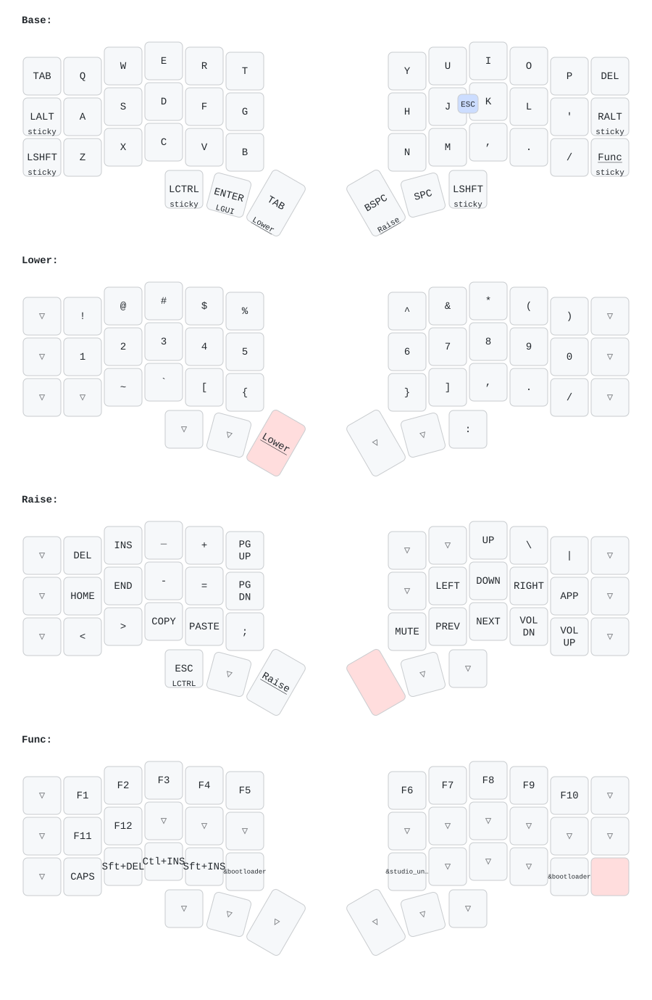

# Mark Stosberg Layout for Cosmos Keyboard

This is an adaptation of [Mark Stosberg's Corne layout](https://github.com/markstos/qmk_userspace/blob/main/keyboards/crkbd/keymaps/markstos/keymap.c) for the Cosmos split keyboard running ZMK firmware.

**PMW3610 + three mouse buttons:** firmware is implemented and builds for both halves. See the [pin allocation, wiring, and hardware bring-up guide](TRACKBALL_MIGRATION.md).

> **Assembly note — C1 substitution:** The tested Sidera board uses **4.7 µF for C1** instead of the BOM's **3.3 µF**, because 3.3 µF was hard to find. It still seems to work fine in the standalone trackball test.

## Layout Overview

Generated via [keymap-drawer](https://github.com/caksoylar/keymap-drawer/) using `nix run .#update-assets`:



### Hyprland shortcuts

See the [Cosmos Hyprland guide](HYPRLAND.md) for IJKL navigation on Raise, physical
key sequences, Deck/zuffie differences, and optional Func utility additions.

**Region screenshot:** tap **Func**, then **Quote (`'`)** to send Print Screen.
Select the region with the trackball and left mouse button; Hyprland opens it in
Satty for annotation, copying, or saving. See the guide for modifier variants.

**Print:** [compact A4 PDF, 2–3 panels/page](assets/cosmos_print.pdf) or
[larger A4 PDF, 2 panels/page](assets/cosmos_print_large.pdf). Both include the
Base/Lower/Raise/Func layouts and the current Hyprland cheatsheet. Print at 100%,
one PDF page per sheet.

<details>
<summary>Show the current Hyprland shortcut map</summary>

Center labels are actions; top labels add Shift; bottom labels identify the
physical Base key. Pink keys are held. **D** means Deck-only and **Z** zuffie-only.
These are reference overlays for the current bindings, not extra firmware layers.


</details>

## Building

```bash
# Build firmware (includes ZMK Studio on the right/central half)
nix build .#firmware
# Outputs: result/zmk_left.uf2 and result/zmk_right.uf2

# Generate keymap and Hyprland reference SVGs
nix run .#update-assets

# Generate printable A4 layout + Hyprland PDFs from the updated assets
nix run .#print-cheatsheet

# Flash (requires hardware) - interactive, goes half by half and tells you what to do
nix run .#flash

# Store the deployed runtime credential in the right half's persistent settings
nix run .#flash -- right --provision
```

> [!WARNING]
> Flash each half with a normal USB data cable, not a charge-only cable. A charge-only cable can power the keyboard while preventing the UF2 drive from appearing.

If the flasher waits with `Please mount the mass storage device at /dev/sdX`, mount the UF2 drive in another terminal:

```bash
udisksctl mount -b /dev/sdX
```

Replace `/dev/sdX` with the device printed by the flasher, for example `/dev/sdb`.

## ZMK Studio

- `nix build .#firmware` builds ZMK Studio support by default.
- ZMK Studio runs on the right half, since it is the split central side.
- Connect the right half over USB, then use `Fn+N` to trigger `&studio_unlock` before connecting from [zmk.studio](https://zmk.studio/).
- Once you start changing the keymap in ZMK Studio, changes to `boards/shields/cosmos/cosmos.keymap` will not apply again unless you restore stock settings in Studio.

## Combos

| Combo | Keys | Output |
|-------|------|--------|
| esc | J+K | ESC |
| private unlock | Hold physical Func+J+K+L for 2 seconds | Dedicated Deck passphrase + Enter, USB-only; requires a provisioned right half |

See [persistent private unlock setup](UNLOCK.md). Provision once with
`nix run .#flash -- right --provision` and the deployed runtime secret; ordinary
public firmware updates then retain the credential in the keyboard's settings partition.

## Important Notes

1. **Split Keyboard**: Right half is central, left is peripheral
2. **Bootloader**: Fn-B for left half, Fn-? for right half
3. **Key Matrix**: 42 connected keys in a 4-row layout; the thumb cluster is the 4th row
4. **Controller LEDs**: The [SuperMini/ProMicro NRF52840](https://github.com/joric/nrfmicro/wiki/Alternatives#supermini-nrf52840) blue charging LED is wired to the charger IC `CHRG` pin, not controlled by ZMK; I destroyed it physically to stop the flashing.

## Trackball Support (Right Half)

The right half uses a [Sidera PMW3610 Rev. 2.x](https://siderakb.ziteh.dev/mouse-sensors/pmw3610/rev2/) sensor and three direct-wired microswitches. The full split firmware has been built and its resolved pins/settings checked; the integrated hardware test is pending.

### Flashing

Use `nix run .#flash` to flash both halves, or `nix run .#flash -- right` for just the central half. For manual copying, the files are `result/zmk_left.uf2` and `result/zmk_right.uf2`.

Enter the UF2 bootloader using Fn-B on the left, Fn-? on the right, or a double reset. Apply the new right-half firmware before testing the buttons: P0.20 was a SPI output in the old firmware.

### Hardware Pinout

| Signal | Pin | Description |
|--------|-----|-------------|
| VIN | 3.3V VCC | Power; bridge sensor JP1 pads 1–2 for 3.3 V logic |
| GND | GND | Ground |
| SCLK | P0.08 | SPI clock |
| SDIO | P0.17 | Single bidirectional data wire; both SPIM MOSI/MISO use this pin |
| nCS | P0.06 | SPI chip select |
| MOTION | P0.02 | Required motion interrupt |
| nRESET | Unconnected | PCB pull-up; the driver resets over SPI |

| Mouse button | GPIO | Pro Micro alias |
|--------------|------|-----------------|
| Left | P0.20 | D3 |
| Right | P1.15 | A0 / D18 |
| Middle | P0.29 | A2 / D20 |

Connect each switch's **NO** terminal to its GPIO and **COM** to a shared GND; leave **NC** unconnected. Firmware provides pull-ups and 5 ms debounce. P0.31 remains spare. The [wiring guide](TRACKBALL_MIGRATION.md) includes J1/FFC pin numbers and the complete matrix pin audit.

### Configuration

- **Driver**: `badjeff/zmk-pmw3610-driver`, pinned to tested ZMK v0.3 revision `5c5af40` in `config/west.yml`.
- **CPI**: 2400, increased from the initial 600 for higher sensitivity; configurable from 200–3200 in steps of 200.
- **Mode**: Interrupt-based, with a 1000 ms extra power-up delay.
- **USB power**: Forced awake with 4 ms sensor sampling (250 Hz), including after long idle periods. On battery, ZMK idle allows the normal sensor rest modes again. `force-awake` and `force-awake-4ms-mode` are set in `cosmos_right.overlay`; the local `patches/pmw3610-usb-awake.patch` adds the USB-power override to the pinned driver. CMake applies it to a build-local copy for both Nix and west/GitHub Actions builds.
- **IRQ GPIO**: P0.02 with `GPIO_ACTIVE_LOW | GPIO_PULL_UP`
- **Orientation**: `invert-y` enabled, `invert-x` disabled. This reverses both axes relative to the previous mounted configuration, following the sensor remount.
- **Lens spacing**: LM18-LSI lens, nominally 2.4 mm from its lowest reference plane to the ball (specified range 2.2–2.6 mm). There is no 2 mm / 3 mm lift-off setting.
- **Input Listener**: `trackball_listener` node converts sensor events to mouse movements without changing keyboard layers
- **Scroll Mode**: Hold the RAISE layer thumb key for momentary scrolling, or use **Raise+H** to latch scrolling after releasing the keys (X/Y axis → horizontal/vertical scroll, at the same 1/256 scale).
- **Buttons**: three dedicated microswitches with an independent GPIO input listener, active on every layer. Keyboard keys do not send mouse clicks. The buttons are not extra remappable positions in ZMK Studio.
- **Configuration files**: `config/cosmos.conf` is shared by both halves; `config/cosmos_right.conf` enables the sensor, GPIO buttons, and right-side USB logging.

The right half exposes separate USB serial interfaces for the log console and ZMK Studio. The log console reports `PMW3610 initialized` on successful sensor startup. To log individual movement deltas, change `CONFIG_PMW3610_LOG_LEVEL_INF=y` to `CONFIG_PMW3610_LOG_LEVEL_DBG=y` in `config/cosmos_right.conf` and rebuild.

### Latched scrolling (right hand only)

1. Press and hold the **right thumb Backspace/Raise**.
2. Tap **H** to activate Raise and latch scrolling immediately, then release H
   and the thumb. The trackball keeps scrolling, while the keyboard returns to Base.
3. Press any keyboard key on either half, or any of the three mouse microswitches,
   to cancel the latch. That press still types/clicks normally; releases do not
   cancel. If Raise is still physically held, its ordinary scrolling continues
   until it is released.

The latch also clears on USB/endpoint changes and is not saved across reboots.
Backspace/Raise is **hold-preferred**: another key press selects Raise immediately;
a tap alone sends Backspace. Its 200 ms quick-tap repeat window allows tap-then-hold
deletion, so pause after a Backspace tap before trying a Raise chord. For a typing
correction, release Backspace before pressing the replacement letter. Holding the
thumb alone activates Raise after 200 ms; trackball motion does not shorten that
wait. Raise+N mutes audio; Raise+Y falls through to Y. The implementation is the
`scroll_latch` behavior plus `cosmos_scroll` input processor, shared by the
trackball and GPIO-button listeners.

### Troubleshooting

- No movement: Check 3.3 V power, JP1, SDIO/SCLK/nCS/MOTION wiring, and lens-to-ball distance.
- Wrong directions: Adjust `swap-xy`, `invert-x`, and `invert-y` in `cosmos_right.overlay`.
- Too sensitive: Lower CPI in steps of 200 (e.g. 1000 or 800), down to a minimum of 200; for finer scaling use a ZMK input processor.
- Not sensitive enough: Raise CPI in steps of 200.
- Missing/inverted clicks: Check the switch's COM/NO terminals and the three GPIO assignments above.
- Slow first movement after idle: On USB, the sensor should stay in performance mode beyond ZMK's 30-second idle timeout. Test after a minute without input; the USB log should show performance register `0xfd` and no `disable performance mode` while USB remains powered. After reconnecting USB while idle, performance mode should enable immediately.
- Studio connection fails: Select the Studio USB serial interface rather than the log console, then unlock using Fn-N.

## Credits

Based on [Mark Stosberg's QMK Corne layout](https://github.com/markstos/qmk_userspace)
